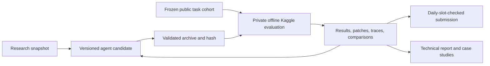

# Gemma 4 Agent Lab

A reproducible development kit for the [Gemma 4 Developer Agent competition](https://www.kaggle.com/competitions/gemma-4-developer-agent). The working objective is a competitive offline coding agent backed by credible experiments, useful tooling, and a clear technical portfolio.

The kit is operational infrastructure, not a claim of competitive performance. The baseline is a single Gemma agent with repository, editing, testing, and graph tools. GPU evaluation uses the official Kaggle starter and harness.



## Quick start

```bash
uv sync --locked
make check
uv run gemma-lab doctor --online
uv run gemma-lab validate agents/baseline
uv run gemma-lab pack agents/baseline
```

Python 3.12, dependencies, and the local CLI are locked in `uv.lock`. Kaggle credentials belong in `~/.kaggle/access_token` or an environment variable. Never add them to this repository. Git uses the existing macOS credential helper.

## Run a real experiment

```bash
# Small downloads, not the full dataset/model.
uv run gemma-lab fetch-starter
uv run gemma-lab fetch HARNESS_README.md tasks.jsonl

# The frozen split in configs/splits/public-v1.json groups identical repo snapshots.
uv run gemma-lab export-tasks data/competition/tasks.jsonl \
  --splits configs/splits/public-v1.json --partition dev --output data/dev.agent.jsonl

# Generate a private offline L4 notebook, embedding the exact validated candidate.
uv run gemma-lab notebook agents/baseline --owner charlesaherbst \
  --slug gemma-4-agent-lab-evaluation
uv run gemma-lab push-notebook notebooks/generated/baseline --execute
uv run gemma-lab status --kernel charlesaherbst/gemma-4-agent-lab-evaluation
uv run gemma-lab pull-output charlesaherbst/gemma-4-agent-lab-evaluation \
  --output runs/kaggle/baseline
uv run gemma-lab report runs/kaggle/baseline/task_results.jsonl
```

By default this evaluates two public smoke tasks. Use `--task-ids path/to/ids.json` with a JSON array to evaluate a fixed dev cohort. Generated notebooks preserve the official offline wheel installation, model registry, vLLM parsers, context compaction, and evaluator. They add archive hash verification, incremental results, patches, diagnostics, and provenance. They do not upload a competition submission automatically.

The submitted three-role candidate is `agents/simple-v3` (earlier pilots remain in `agents/simple-v1` and `agents/simple-v2`); its design review and known limits are in [SIMPLE_V1](docs/SIMPLE_V1.md). It uses declarative sequential localization, repair, and independent verification. GPU evidence is tracked in [STATUS](docs/STATUS.md).

The evaluated development candidate is `agents/structured-v4`: tool-free triage, isolated repair/verification contexts, and scoped task-memory, source-lookup, and verify-patch skills. See [STRUCTURED_V4](docs/STRUCTURED_V4.md). Its official three-task diagnostic resolved 1/3 with zero skill invocations; it is not promoted. See [diagnostic results](docs/STRUCTURED_V4_DIAGNOSTIC.md).

The current longer-budget development variant is `agents/structured-v4-10m`: 10 minutes per task, 80 counted tool calls, 60 model turns, and a 300-second command timeout. It has not been evaluated or submitted.

## Develop and compare

Copy `agents/baseline` to a candidate directory, change one hypothesis, evaluate the same task IDs, and compare:

```bash
uv run gemma-lab report runs/candidate/task_results.jsonl \
  --baseline runs/baseline/task_results.jsonl --output runs/comparison.json
uv run gemma-lab research --query 'Gemma coding agent' --output runs/research/latest.json
```

Reports include resolution rate, Wilson intervals, per-repository counts, tool usage, elapsed time, paired wins, and regressions. Research snapshots collect current public GitHub repositories, competition notebooks, and leaderboard entries. Review primary sources and licenses before incorporating any code or data.

## Submit a checked archive

```bash
uv run gemma-lab pack agents/candidate --output artifacts/candidate/submission.zip
uv run gemma-lab submit artifacts/candidate/submission.zip --message 'experiment ID and hypothesis'
# After examining the plan and completed evaluation:
uv run gemma-lab submit artifacts/candidate/submission.zip \
  --message 'experiment ID and hypothesis' --evaluation runs/candidate --execute
uv run gemma-lab status
```

The uploader requires completed evaluation outputs matching the exact archive hash and task cohort, checks Kaggle history, enforces the one-per-UTC-day slot, prevents identical resubmissions, and reserves the slot locally before a network upload. An interrupted upload needs history reconciliation before retrying. Portable checks are supplemented by the official harness checks inside the GPU notebook.

## What lives where

| Path | Purpose |
| --- | --- |
| `agents/` | Declarative competition agents, prompts, generation and budget configs |
| `src/gemma_lab/` | Environment checks, research, data splits, packaging, notebook and submission operations |
| `configs/splits/` | Frozen task IDs and source checksum; no reference solutions |
| `tests/` | Archive security, answer redaction, paired metrics, submission reservations, SFT filtering |
| `training/` | GPU-only LoRA SFT recipe and verified trajectory filtering |
| `docs/` | Competition contract, runbook, research plan, portfolio evidence requirements |
| `data/`, `vendor/`, `runs/`, `artifacts/` | Ignored local data, official source, results, models and archives |

See [RUNBOOK](docs/RUNBOOK.md), [COMPETITION](docs/COMPETITION.md), [RESEARCH](docs/RESEARCH.md), and [PORTFOLIO](docs/PORTFOLIO.md). The repository stays private during development. A public release needs a data/license review and sharing on the competition forum or notebooks as the rules require.
