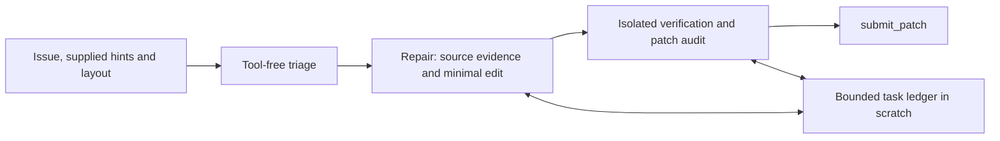

# Gemma 4 Agent Lab

Public source and handoff notes for an offline coding-agent prototype in the
[Google – The Gemma4 Developer Agent competition](https://www.kaggle.com/competitions/gemma-4-developer-agent).
This repository contains our agent/toolkit code and redacted experiment observations.
It does not contain competition tasks, repository snapshots, grading patches, raw
traces/logs, generated patches, credentials or model weights.

**For Grok or another coding agent: start with [docs/HANDOFF.md](docs/HANDOFF.md).**
The latest10minute candidate resolved3/3 selected diagnostic tasks; two resulting
patches still contain scratch files. This is not evidence of broad generalization or
submission readiness. The one uploaded competition submission is currently ERROR,
without a leaderboard score.

## Read in this order

| Document | Purpose |
| --- | --- |
| [AGENTS.md](AGENTS.md) | Development contract, data boundaries, testing and submission rules |
| [HANDOFF](docs/HANDOFF.md) | Current state, immediate work, reproducible commands, copyable bot prompt |
| [STATUS](docs/STATUS.md) | Actual candidates, hashes, results and blockers |
| [HARNESS_SPEC](docs/HARNESS_SPEC.md) | Agent/compiler/sandbox/grading/controller layers and budgets |
| [RUN_CATALOG](docs/RUN_CATALOG.md) | All14 run/preflight summaries, cohorts and interpretation caveats |
| [Structured v4](docs/STRUCTURED_V4.md) | Current architecture, scoped skills and known limitations |
| [10minute diagnostic](docs/STRUCTURED_V4_10M_DIAGNOSTIC.md) | Latest paired results, stage timing, skill behavior and hygiene |
| [Harness review](docs/HARNESS_REVIEW.md) | Evidence-based priorities and experiment roadmap |
| [RUNBOOK](docs/RUNBOOK.md) | Environment, official GPU evaluation, collection and checked uploads |
| [HYGIENE](docs/HYGIENE.md) | Offline patch-hygiene rule IDs and the measured-mean runtime gate |
| [COMPETITION](docs/COMPETITION.md) | Contract summary; official rules remain authoritative |

Earlier designs/results: [SIMPLE_V1](docs/SIMPLE_V1.md),
[EXPERIMENT_RESULTS](docs/EXPERIMENT_RESULTS.md),
[v4 five-minute diagnostic](docs/STRUCTURED_V4_DIAGNOSTIC.md).
Research/training plans: [RESEARCH](docs/RESEARCH.md), [PORTFOLIO](docs/PORTFOLIO.md).

## Current candidates

| Source | State | Measured outcome |
| --- | --- | --- |
| agents/simple-v3 | Uploaded as ref56905832; current server status ERROR, no score | Official public-dev3/13; not a leaderboard score |
| agents/structured-v4 | Five-minute evaluated development candidate | Diagnostic1/3, zero skill calls, two timeouts |
| agents/structured-v4-10m | Latest development candidate; not submitted | Same diagnostic3/3, two paired wins; scratch/fallback issues remain |

Latest archive SHA256:
`0730b5f0a373fc23bdb4362779a4757ded14cfa6a77896c7d54ce3efb7ad8cab`.
Candidate source commit: `b00526833928c5ce9f1e181b77ad982e5bf12e84`.

Budget is shared across all roles:10minutes,80 counted tool calls,60 model turns,
300seconds per command capped by remaining task time. The competition-wide12hour
patch-generation limit still requires measured full-run averages/setup before promotion.

## Architecture and scoped skills



The agent is declarative ADK with three Gemma LlmAgent roles, one base model
`gemma-4-31b-it-qat-w4a16-ct`, no custom tool imports or trained adapters. Repair and
verifier use explicit state handoffs and isolated conversation history.

| Skill | Scoped repeated workflow |
| --- | --- |
| [task-memory](agents/structured-v4-10m/skills/task-memory/SKILL.md) | Locked/atomic task-bound ledger of facts, rejected hypotheses and checks; no transcripts |
| [source-lookup](agents/structured-v4-10m/skills/source-lookup/SKILL.md) | Bounded read-only literal search and line windows |
| [verify-patch](agents/structured-v4-10m/skills/verify-patch/SKILL.md) | Scratch-only repros, same-test contracts, real exit statuses, fingerprints and read-only syntax/hygiene audits |

Official SDK preflight confirms tool exposure and script execution. Gemma often
bypasses skills through raw tools. Skill availability is not skill adoption, and
sequential order is not a hard guarantee that verifier gets time to execute.

## Findings worth carrying forward

- Removing locator shell access stopped observed locator-created scratch leakage.
- Tool-free triage completed in roughly16–25seconds in diagnostics.
- Increasing5→10minutes enabled two formerly failing diagnostic cases to make fixes
  after the old cutoff. These are selected small-cohort observations, not a general score.
- One verifier used the skill audit to remove test edits and then reverified the
  current fingerprint before explicit submission. Two other passes used fallback
  capture and retained scratch. Independent fresh grading proves those patches passed,
  but does not prove compliance with the intended workflow.
- Prompt limits and skill selection remain soft. Next priority is fewer bypasses and
  dependable clean finalization, followed by matched controls and broader dev tests.
- Error reporting has blind spots: timeouts can coexist with missing grading
  dependencies/fixtures. Preserve raw outcomes and separate concurrent failure axes.
- Holdout never evaluated; no model training or paid hardware; no recurring jobs.

## Local toolkit checks

```bash
git clone https://github.com/CharlieHerbst331/gemma4-agent-lab.git
cd gemma4-agent-lab
uv sync --locked
make check
uv run gemma-lab validate agents/structured-v4-10m
uv run gemma-lab pack agents/structured-v4-10m \
  --output artifacts/structured-v4-10m/submission.zip
```

Python3.12 is locked via uv.lock. Tests execute trusted synthetic fixtures, not
competition repositories on a personal Mac. GPU/official benchmark execution uses
a disposable offline Kaggle worker; see HANDOFF/RUNBOOK for exact commands.
Credentials are supplied separately through your authorized account. Do not commit
access tokens or use a public clone as evidence that private outputs are accessible.

## Public evidence and reproducibility

[evidence/run-results.json](evidence/run-results.json) exports allowlisted observations
from14 runs/preflights: IDs, outcome counts, timings, tool counts, archive/revision/task
checksums, package versions and hardware when recorded. It excludes raw inputs,
patches, traces, logs and sensitive paths. [RUN_CATALOG](docs/RUN_CATALOG.md) documents
historical error-label omissions and cohort differences.

Original evidence is retained privately by its owner, with hash bindings in the
public summary. A fresh clone can recreate candidates and generate its own official
runs after obtaining authorized competition inputs; it does not contain our raw
private evidence. Regenerate public observations with:

```bash
uv run python scripts/export_public_findings.py --source runs/kaggle \
  --output evidence/run-results.json
```

Public cohort manifests are in configs/cohorts; grouped train/dev/holdout identifiers
and source checksum are in configs/splits. They contain identifiers, not task text or
reference/grading patches. Never train on dev/holdout outcomes or feed grading
metadata into the agent. The optional training recipe has not been GPU-validated.

## Publishing and license

Own source is Apache2.0; see [LICENSE](LICENSE) and [NOTICE](NOTICE). Official competition
packages, data, notebooks and models retain their licenses/terms and are fetched
separately. No official harness or model is bundled.

The owner authorized public GitHub release for this handoff. The competition-associated
Kaggle code-sharing notebook/post is **pending owner action**; the owner asked to add
it later. No public Kaggle notebook was created by this release. See
[PUBLICATION](docs/PUBLICATION.md) and the official competition rules.
