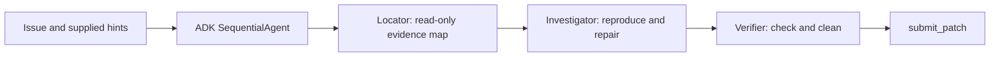

# Simple agent: design and experimental revisions

The first candidate keeps the proposed locator → root → investigator architecture.
It uses exactly one Gemma 4 QAT base model, the nine official tool names, two
AgentTools with `skip_summarization: true`, and no adapters or executable host code.
The root owns verification and submission; a fourth verification agent adds latency
and another opportunity to lose evidence without isolating a distinct responsibility.

## Review and targeted refinements

- **Localization scope:** normally 2–4 evidence-backed candidates and at most six
  exploration calls. Forcing 5–10 reads or 3–8 suspects wastes time on explicit issues.
  Literal/path clues use text search first; ambiguous symbols use optional graphs.
- **Scratch access:** harness file tools resolve paths inside `/workspace`; `/tmp`
  notes and scripts therefore use `run_command` with quoted heredocs. The revised locator returns the brief directly and creates no files, avoiding an observed workspace scratch leak.
- **Read-only boundary:** locator has no editing/file-writing tools, but its shell
  capability is not a hard read-only sandbox. Its prompt restricts shell use to
  searches only. Declarative configuration cannot enforce this policy.
- **Evidence before edits:** the investigator checks a specific hypothesis and
  reproduces the relevant failure before changing implementation. Related files may
  require multiple small edits; a strict one-file rule can produce incomplete fixes.
- **Verification:** the root reuses the same behavior check, checks ordinary behavior,
  then runs narrow existing tests when affordable. New repro tests stay in `/tmp`;
  verification resets repository target tests, so altered tests cannot prove a fix.
- **Loop control:** one locator and at most two investigator invocations, with a
  strategy change after three calls without new evidence. Repeating verification
  after a code change is required; only unchanged failing calls are discouraged.
- **Context and time:** 4,096 output tokens and 2,048 thinking tokens per role,
  temperature 0.5. Baseline smoke hit the 32,768 context ceiling with 16,384 output
  tokens reserved. Smaller output leaves room for tool history and compaction.
  Sampling is a starting hypothesis, not evidence that higher temperature helps.
- **Budget:** five minutes, 80 counted calls, 60 turns, 300-second official verification/command cap; prompts
  aim for 30-second commands and reserve the last 60 seconds/eight calls for verification.
  Across 120 tasks, the configured task ceiling is ten hours, leaving nominal setup
  margin under twelve hours. Actual setup and hardware timings still need measurement.
- **Protected files:** `/workspace/pytest.ini` and `/workspace/conftest.py` must stay
  unchanged. No dependencies, scratch in patches, hidden tests, or reference answers.

The YAML lives in `agents/simple-v1`. Child prompts sit beside their YAML because
includes are relative to each config and portable validation rejects `..` traversal.
No skills are included: these short rules fit directly in the prompts without
requiring extra skill-loading calls.

## Reproduce

```bash
uv sync --locked
make check
uv run gemma-lab validate agents/simple-v1
uv run gemma-lab pack agents/simple-v1 --output artifacts/simple-v1/submission.zip
uv run gemma-lab notebook agents/simple-v1 --owner charlesaherbst \
  --slug gemma4-simple-v1-dev3 --task-ids runs/experiments/simple-v1/dev-3.json \
  --output notebooks/generated/simple-v1-dev3
```

The fixed initial cohort takes the first task ID of each represented repository in
`configs/splits/public-v1.json`: `fastapi_11194`, `requests_7502`, `rich_3105`.
This is a small dev pilot, not a generalization estimate. Baseline uses the exact
same IDs. Holdout has not been evaluated for this candidate.

Evaluation runs the official starter and swegemma harness on a disposable offline
Kaggle GPU worker. Do not execute task repositories on this Mac. Archive hashes,
source-file hashes, hardware, package versions, task checksum, results, and errors
are persisted in ignored run directories. Returned harness errors must be recorded:
the evaluator can report `status: SUCCESS` alongside a context or budget failure.
Timeouts are agent-budget failures; other runner errors block the checked uploader.

Portable validation alone does not establish ADK compilation or performance.
Prompt budget limits and read-only behavior are soft policies; measure compliance
in traces. Context exhaustion is still possible despite the reduced output ceiling.

## Pilot result and revision

The first pilot resolved 1/3 versus the baseline's 0/3 on the identical dev cohort
(one FastAPI win, no regressions), on 4 × NVIDIA L4 with swegemma 0.2.7 and google-adk
1.36.1. Candidate generation/verification duration totaled 992.7 seconds versus
1165.5 seconds; these task durations include overhead and are not pure generation time.
Two candidate sessions and all three baseline sessions timed out. The candidate
Requests grading also hit the configured 60-second test timeout. Its patch included
workspace scratch and debug output. It was not submitted.

Trace review found ignored soft exploration limits, skipped investigator delegation,
malformed read_file arguments, and a repro catching exceptions with exit zero. The
revised prompts are shorter, require investigator dispatch, make argument fields
explicit, forbid locator writes, and demand propagating assertions and removal of
added debug/scratch. Verification uses the official 300-second timeout. Issue-number-
only tasks should end cleanly without guessing unrelated defects. These changes are
motivated by trace evidence, not proven until the revised runs finish.

The revised archive is evaluated on the same three tasks for paired comparison and
on the full frozen 14-task dev set. This remains dev evidence; holdout is untouched.

The baseline Requests verification produced 196 recursive `httpbin` fixture setup
errors. This is an official worker environment failure, so the Requests result is
inconclusive for patch correctness. Raw outputs stay intact; annotated analysis must
separate it. The checked uploader inspects diagnostics as well as summary rows to
block this known fixture error. A separate same-archive two-task dev evaluation uses
the unaffected FastAPI/Rich pilot IDs for clean submission provenance; exclusion is
an infrastructure accommodation, not a change to the recorded full dev cohort.

## Sequential refinement

R1 improved scratch hygiene but resolved 0/3 and still never dispatched investigator.
The active `agents/simple-v2` therefore uses a declarative SequentialAgent wrapper
with three LlmAgent roles: locator, investigator, verifier. This enforces role order
without extra model calls for routing. `output_key` carries localization and repair
reports through session state. The verifier owns cleanup, independent checks, and
submit_patch. Thinking budgets are 512/1024/1024 with 4096 output tokens per role.
All previous contracts and five-minute task limits remain. Exploration/time limits
inside a role are still soft and require trace inspection.

The two-task clean run is infrastructure/submission evidence only. The former R1
full-dev run is retained for honest reporting; it cannot establish v2 performance.
The separate clean run failed before model setup because the dataset was not present
at the starter's hard-coded path. The generator now discovers an alternate official
wheelhouse mount and fails explicitly if none is found, preserving offline setup.

## Current execution path



Sequential orchestration enforces role order, not the quality or maximum duration
of each role. The FastAPI smoke success still used the harness's patch fallback
before explicit submit_patch. The Rich issue-number-only input produced no fix.
These are measured limits to address next, not reasons to claim broad reliability.

## Capability restriction after broader v2 evaluation

V2 dev13 remained at 3/13 with nine timeouts and net zero paired wins versus R1.
Its failed cases exposed locator-written workspace repro scripts. V3 removes
run_command from locator, making that role read-only through its attached tools.
Text-search fallback moves to investigator; graph results remain checked against
source. write_file is removed from investigator/verifier as well. Shell-based /tmp
repros and editing still require prompt discipline, so no universal hygiene guarantee
is claimed. This refinement follows trace attribution, not a preference for more roles.

## First accepted submission

The submitted source is `agents/simple-v3`, SHA256
`50d7b69dd4d0f6a5b4925bda919f69e57196b72337190bd6073be95591ff2646`.
Official dev13 evaluation resolved3/13, exactly the same three as v2, with no
infrastructure errors and ten budget failures. Locator capability restriction removed
observed workspace repro pollution; performance and timely finalization remain limited.
The checked uploader accepted submission56905832; leaderboard score is pending.
See STATUS.md for reproducible evidence and next steps.
