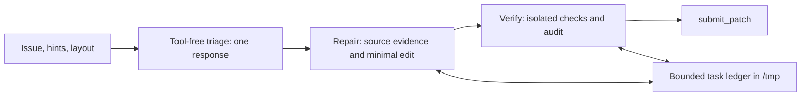

# Structured v4 candidate

This implements the October7 review's bounded-triage direction and three narrowly
scoped skills. It is a new development candidate; submitted simple-v3 stays immutable.
No new competition upload is authorized by packaging, and no performance gain is claimed.

## Agent flow



- Declarative SequentialAgent with exactly three Gemma LlmAgent roles.
- Triage: no tools/skills, 1024 output tokens,256 thinking tokens; returns issue clues,
  repository/layout anchors and supplied hints. No repository exploration loop.
- Repair/verifier: include_contents:none, explicit problem/triage/repair state keys.
  Earlier tool transcripts are not passed as their conversation history. State summaries
  and scratch evidence preserve needed facts; they do not provide automatic general memory.
- Same base model, temperature0.5,4096 output/1024 thinking for repair/verifier.
- Same global five-minute/80-call/60-turn budget as v3. Per-phase deadlines and skill
  selection remain model-controlled. No custom tools, callbacks, host entrypoint, or adapters.

## Why each skill exists

| Skill | Repeated task and trigger | Deterministic resource | What it does not do |
| --- | --- | --- | --- |
| task-memory | Preserve decisions after hypothesis changes, failed checks, context gaps and handoffs | Locked atomic ledger;4200-character schema;workspace/baseline binding;deduped evidence/query keys | Store full transcripts, grading answers, or cross-task solutions;prove a written pass |
| source-lookup | Find literal issue clues and inspect small source windows across a large repository | Read-only scoped search;5s/1200 eligible files/20 hits;80-line windows;~4000-character output | Whole-repo summaries, live semantic embeddings, automatic hypothesis selection |
| verify-patch | Create/reuse a repro, preserve exit status, audit after edits and before submission | /tmp-only repro/probe;assertion checks;baseline source hash contract;1-30s process group;1MiB output cap;patch fingerprints;read-only syntax/hygiene audit | Guarantee assertion relevance, independently prove semantics, automatically revert/submit, hard-schedule the model |

These skills correspond to observed faults: repeated navigation and rediscovery;
malformed/large source reads; caught assertions, workspace scratch, test edits and
stale validation. They are attached only where used: triage none, repair all three,
verifier task-memory/verify-patch. No general-purpose skill collection is installed.

Skills use the official compiler's SkillToolset and official sandbox executor.
Their Python lives only under skills/*/scripts, not a host agent entrypoint. SDK script
materialization changes cwd, so helpers discover sandbox workspace via PWD and scratch
via TEST_TMPDIR. They do not use the materialization directory as the repository.
Flat argument options avoid nested JSON escaping for common memory/search operations.
Scripts must run sequentially around repro/audit because scratch state is shared.

## Local validation and limits

`make check` exercises trusted synthetic Git repositories only, never competition
snapshots on this Mac. Tests cover traversal/symlinks, bounded output, concurrent and
corrupted memory, task isolation, actual before/after failures, stale fingerprints,
changed assertions, missing imports, process timeouts, Unicode logs, hard output size,
protected files, repository test edits, untracked artifacts, and the live official
executor wrapper exception. Triage capability and isolated handoffs are also checked.

All three manifests pass skill-creator validation. Portable validation/packaging is
required. These do not establish official ADK compilation, skill selection by Gemma,
or improved resolution rate. Official interface compatibility was reviewed against
swegemma0.2.7/adk-submission0.2.12/google-adk1.36.1 wheel source; no GPU dependencies
were installed on the Mac. The official GPU harness remains the runtime authority.

The audit conservatively blocks untracked new implementation files and test edits;
those cases need manual review or an intentionally redesigned policy. AST checks catch
common swallowed assertions, not all possible false passes. Skill invocation adds
latency/tool overhead and may be skipped. Include_contents:none can lose information
if triage omits important hints. These are explicit evaluation targets.

## Reproduce and evaluate

```bash
uv sync --locked
make check
uv run gemma-lab validate agents/structured-v4
uv run gemma-lab pack agents/structured-v4 --output artifacts/structured-v4/submission.zip
```

Use a frozen diagnostic subset first: a v3 localization-loop case plus two completed
repair cases. Generate the official private notebook with that IDs file. Measure triage
completion, time-to-first-edit, skill invocation/valid arguments, memory usage, verifier
reach, explicit finalization, patch hygiene, execution/verification errors and paired
resolution. Pilot results are mechanism/infrastructure checks, not generalization.

Before attributing gains, compare a triage-only control and/or a matched single agent;
v4 bundles triage, history isolation and skills. Then evaluate identical full dev IDs.
Keep holdout reserved. Do not promote or submit v4 merely because helper tests pass.
