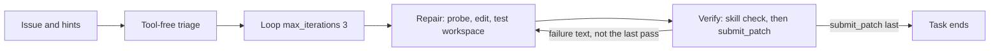

# Structured v5 candidate

Unevaluated development candidate forked from `agents/structured-v4-10m`. It does
not replace that candidate, its archive, or its 3/3 diagnostic. No GPU run, score,
or submission is claimed. `agents/structured-v4`, `agents/structured-v4-10m`, and
`agents/simple-v3` are unchanged.

Hypothesis: a short repair/verify loop, thinking disabled, a hard tool boundary on
verify, and an explicit workspace-import rule reduce late edits, context overflow,
and host-package confusion inside a 270 second task. That is a mechanism hypothesis.
It is not a measured gain.

## Flow

Root is a SequentialAgent: triage, then a LoopAgent of repair and verify.
`max_iterations` is 3. Omitting it compiles to 500, so the cap is explicit.
There is no `exit_loop` tool. When the loop finishes without a submission, the
harness nudge starts the root again, which reruns triage. Verify's prompt therefore
calls `submit_patch` on iteration 3, and whenever fewer than 60 seconds remain,
whether or not the check passed. Before starting that check, verify reads
`get_status` again and submits immediately if fewer than 60 seconds remain.
Repair hands off when about 90 seconds remain so that margin is still available.

## Token arithmetic

The model context is 32768 tokens. vLLM 0.19.1 rejects a request when the prompt
is at least 32768 tokens, or when prompt plus `max_output_tokens` exceeds 32768.
That rejection is not retried. `swegemma` 0.2.7 sets `agent_patch = ''` before the
loop and copies a submitted patch only after the loop returns. Any other exception
skips that copy and the fallback diff. A context overflow therefore drops even a
patch that was already submitted. Submitting early is not protection against overflow.

| Role | max_output_tokens | Prompt must stay under |
| --- | --- | --- |
| triage | 1024 | 31744 |
| repair | 2048 | 30720 |
| verify | 1536 | 31232 |

The largest reservation is 2048, so every call needs its prompt under 30720 tokens.
Thinking is off, so those completion tokens are not shared with a thinking budget.
`include_contents: none` is set on triage, repair, and verify. The field is legal
only on LlmAgent; the SequentialAgent and LoopAgent do not set it. Each role then
sees the current user message or the previous role's final reply, plus its own
tool results for the current turn, instead of the other role's tool transcript.

Prompts bound tool output: `read_file` ranges of at most 80 lines, shell output
through `head -n 40` and `head -c 4000`, source-lookup's existing hit and window
caps, and verify-patch's truncated JSON. Triage has no tools, so it cannot
accumulate a tool transcript. `{problem_description}` is in every instruction
because a nudge is a new user message and the earlier harness prompt is outside
the `include_contents: none` window. `{hints?}` is the ADK 1.36.1 optional form:
the harness adds `hints` to session state only when hint text is non-empty
(`agent_runner.py` session_state), and a required `{hints}` raises `KeyError`
otherwise.

## Thinking knob

`sub_agents/thinking.yaml` is the only thinking control. All three roles include
it. The file sets `include_thoughts: false` and does not set `thinking_budget`.
On both adk-submission 0.2.11 and 0.2.12 that turns thinking off and sends no
`thinking_token_budget`. A budget of 0 compiles only on 0.2.12 (`ge=0`); 0.2.11
rejects it (`ge=1`). The ablation needs adk-submission 0.2.12. In this same
file, set `include_thoughts` true and add `thinking_budget` 256. On 0.2.12 that
turns thinking on and forwards the numeric budget. On 0.2.11 the same change
compiles, but the budget is dropped and only `enable_thinking` is sent.
Temperature stays 0.5 and top_p stays 0.95. Temperature 0.2 is not used.

## What changed from structured-v4-10m, and why

| Item | v4-10m | v5 | Why |
| --- | --- | --- | --- |
| Shape | Sequential triage, repair, verify | Sequential triage, Loop(3) of repair then verify | A failed verify can send one concrete failure back. The cap is small because exhausting it reruns triage. |
| Time / calls / turns | 10 min, 80 calls, 60 turns | 4.5 min (270s), 48 calls, 64 turns | Coordinator cap is 270s and 40-60 calls. Skill script runs count as tool calls, so turns and counted calls are roughly co-binding, and the 270s clock usually binds first. 64 turns keeps the turn cap from being clearly tighter than the call cap. Command ceiling stays 300s and is still lowered by remaining task time. |
| Thinking | 256 / 1024 / 1024, thoughts on | `include_thoughts: false`, no budget, one file | Thinking off on 0.2.11 and 0.2.12, with no budget sent. A budget of 0 fails to compile on 0.2.11. One file is the ablation knob. |
| Output cap | 1024 / 4096 / 4096 | 1024 / 2048 / 1536 | Keeps prompt + completion under 32768. Overflow discards a submitted patch. |
| Triage contents | `default` | `none`, plus `{problem_description}` and `{hints?}` | A nudge must not replay the whole tool history. The issue still has to be in the instruction. |
| Triage work | Tool-free brief | Still tool-free. The brief names at most 3 unverified files. Identical calls are refused because there are no tools. | See the ambiguity note below. `tools: []` is the structural bound. Per-agent `max_llm_calls` is rejected by the schema. |
| Repair deadline | Soft handoff at 360s | Provisional edit by about 12 counted calls or 95s (35% of 270s) | Late first edits were the diagnostic failure mode. No repeated identical calls. |
| Repair submit | Not present | Still not present | A safety-net submit would skip verify. Evidence below. |
| Verify tools | get_status, read_file, edit_file, run_command, submit_patch, plus task-memory | get_status, read_file, edit_file, submit_patch, plus verify-patch only | The spec's tool list. No shell and no `write_file`, so the check goes through the skill. |
| Verify stop rule | Submit once after a fingerprint match | Submit on the first passing workspace check. On an earlier failure, return a concrete `loop_iteration` report and do not submit. On the last iteration, or with fewer than 60 seconds left, submit anyway. An UNCERTAIN report with an empty audit diff is submitted immediately. After `submit_patch`, reply with exactly one short sentence. | No exit tool. A text-only final event after submit ends the task (`agent_runner.py` 556-579). An empty reply lets the loop continue into repair, and those later edits are dropped. |
| Import rule | Soft "workspace import details" | Exact `module.__file__` probe in the triage and repair prompts. `INSTALLED-COPY` plus `/workspace/src` means `PYTHONPATH=/workspace/src:/workspace`. Never `python -I` or `python -E`. | Subprocess sandbox sets PYTHONPATH to the workspace root and skips the editable install. |
| verify-patch | Root pytest.ini / conftest.py and `tests/` / `test/` prefixes | The grading predicate: named config and import-hook files, `test_*.py`, `*_test.py`, `.pth`, and `.py` under `tests` / `test` / `testing` at any depth (directory names case-insensitive). Non-Python files under those directories are not flagged. Repro child `PYTHONPATH` is `/workspace/src:/workspace`. JSON adds `import_origin` and `default_import_origin`. | Flag what grading resets, including import hooks that would distort the agent's own check. Report where the check imported the package. |
| Scratch | `/tmp` only, as a prompt | Top-level `/workspace/build/` or `/tmp` in every prompt that can create files, and in the skill. Never a real source file under a nested `build/` or `dist/`. | Untracked `build/`, `dist/`, and `.adk_exec_*.py` are git-excluded at any depth. A new source file under `pkg/build/` would be dropped. |
| task-memory, source-lookup | Present | Byte-identical copies | No new skills. Repair still has them. Verify does not load task-memory. |
| Graph tools | On repair | Still on repair | Not part of the binding change. The prompt allows one lookup, then stops. |
| Sampling and model | 0.5 / 0.95, `gemma-4-31b-it-qat-w4a16-ct` | Same | Temperature 0.2 loops. No adapters, callbacks, or custom tools. |

Callbacks and per-agent `max_llm_calls` are not used. The schema accepts callback
names and then drops them, and `max_llm_calls` is an extra field that fails
compilation.

## Repair does not submit

The coordinator asked for a repair safety-net `submit_patch` after the first
passing check or near the deadline, unless a submission ends the task before verify.

`submit_patch` in swegemma 0.2.7 only stores the diff and sets `patch_submitted`.
The runner then ends the task on either of two conditions (`harness/agent_runner.py`):

- A final response from any non-tool author that contains text and no function
  call, once a patch has been submitted (`agent_runner.py` 556-579).
- `run_async` returning after any submission (`agent_runner.py` 635-637), which
  also skips the nudge.

Repair has to finish with a text report. That report is its `output_key` and the
message verify must see. That text is a final response after the submission, so
the event loop breaks and the LoopAgent never reaches verify. An LlmAgent does
not finish on a tool call; it continues until the model returns a response
without tool calls, which is the text handoff. There is no supported way for
repair to submit and still transfer.

v5 therefore leaves `submit_patch` off repair. Overflow is handled by the output
caps, `include_contents: none`, and bounded tool output above. The guaranteed
final submit is verify's, including on the last iteration and when fewer than
60 seconds remain. Repair is told to hand off at about 90 seconds remaining, and
verify reads `get_status` again before starting its check, so a clock that has
already fallen under 60 seconds does not begin a full repro. The submitted patch
is copied after the loop
(about line 758) only when `patch_submitted` is set; the fallback diff runs only
when it is not (about 760-776). Other exceptions (about 799) skip both.

Checkpoint submits still matter inside verify: a timeout or turn cap keeps a
patch that was submitted before the exception, and a later edit is not in that
patch unless verify submits again. They do not survive a context overflow.

## Import origin and src-layout tasks

The import-origin probe checks `module.__file__` from `/workspace`, not `pip show`.
Flat layouts (FastAPI, Rich) import the workspace when PYTHONPATH is the workspace
root. src-layout repos do not: the default import is the host copy. The requests
tasks are src-layout. In our notebook's subprocess sandbox, both the agent's raw
`python` and the official grading command import the host `requests`, so a local
pass or fail on those tasks is unreliable in either direction.

Promotion rule: src-layout requests tasks are excluded from promotion decisions
until grading imports the workspace copy. dev13 and the diagnostic cohort are
FastAPI and Rich only; they are not
excluded by this shadowing result. Host dependency versions (starlette, pydantic)
still apply to those runs. The hidden scorer's sandbox (Docker editable install
versus subprocess) was not re-checked here.

verify-patch sets the repro child's `PYTHONPATH` to `/workspace/src` first, then
the workspace root (`/workspace/src:/workspace`), the same order the prompts use
after an `INSTALLED-COPY` probe. The origin probe uses `python -P` so the
workspace cwd does not jump ahead of that order. `-P` is not `python -I` or
`python -E`. `default_import_origin` repeats the same imports with only the
workspace root on `PYTHONPATH`. That root-only value is the sandbox default, not
a second ordering, and it is what a raw command and notebook grading see.
`imports_installed_copy` is true only when the skill's own child environment
imported a host copy.

## Spec notes

- Triage stays tool-free. The binding line asks triage to identify the top 3
  files with no repeated identical calls. A tool-using triage cannot be hard-capped:
  per-agent `max_llm_calls` fails schema validation, and callbacks are dropped.
  `tools: []` is the bound that actually holds. The brief must name at most 3
  unverified files from the issue, hints, and layout. Repair owns the 12-call /
  95-second edit rule and the identical-call ban. If triage was meant to search,
  that needs a different structure than an uncapped LlmAgent.
- `max_iterations` is 3, not 4. Three repair/verify passes already fill a 270s
  clock. Four would make the nudge-restart of triage more likely.
- Turn limit is 64, with 48 counted calls, inside a 270s clock. Skill script
  runs count as tool calls, so turns and counted calls are roughly co-binding,
  and the 270s clock usually binds before either. `get_status` and
  `submit_patch` do not count as tool calls but do count as turns.
  `get_status` reports `max_turns` and does not report turns used.
- The protected-path audit matches grading's
  `_is_protected_test_or_config_path` (`swegemma/harness/verification.py`
  60-83, applied at 389-414): `conftest.py`, `pytest.ini`, `pyproject.toml`,
  `tox.ini`, `setup.cfg`, `.pytest.ini`, `sitecustomize.py`, `usercustomize.py`,
  `_swegemma_stubs.py`, any `.pth` file, `test_*.py`, `*_test.py`, and any `.py`
  file under a `tests`, `test`, or `testing` directory. Directory names are
  matched case-insensitively and at any depth. A non-Python file under those
  directories is not protected. Import-hook files are included because grading
  resets them and they can distort the agent's own sandbox check.
- `{hints?}`, `{triage_brief?}`, and `{repair_report?}` are optional. ADK writes
  an `output_key` only when the final event has non-thought text. A missing
  required placeholder raises `KeyError`, and that path skips the fallback diff.
  Empty hints are also omitted from session state. The optional form is
  google-adk 1.36.1 `inject_session_state`.
- History compaction is a known interaction, not a measured fix. The starter
  notebook enables ADK compaction (`token_threshold=14336`,
  `event_retention_size=5`). The summarizer sees text parts only, so tool calls
  drop out. A compaction event is authored as a user event, and with
  `include_contents: none` the next request can hold only that summary. Repair
  makes the provisional edit by about 12 counted calls. Every few calls it puts
  the checkpoint (target files, edits, and the last check result) in the same
  response as the next tool call. A reply with no tool call is the final
  response and ends the turn, so that text is sent alone only in the final
  report. Whether the
  scorer enables the same compaction is unconfirmed. `notebook.py` keeps the
  starter EvalConfig cell and does not rewrite that setting.
- Graph tools remain on repair. Dropping them would be a separate confound.
- No new skill. verify-patch gained import-origin fields and a wider audit. It
  did not gain a clean or pytest mode. Verify has `edit_file` for a revert it can
  reconstruct, then must submit again. It cannot `rm` scratch. Scratch is supposed
  to be excluded by path.

## Validation

`gemma-lab validate agents/structured-v5` passed: 16 files, portable checks
passed. `make check` passed: ruff, format, and 112 tests. The new tests load
`agents/structured-v5`'s ledger, lookup, and verify-patch modules. They do not
replace `tests/test_agent_skills.py`, which still loads `agents/structured-v4`.

Archive SHA256:
`6202ab26252df59061547e0fd7dbcc1e8ef62b5cb12c61c14c2b2e953865bbb5`.
Repacked evaluated archives were unchanged: structured-v4-10m
`0730b5f0a373fc23bdb4362779a4757ded14cfa6a77896c7d54ce3efb7ad8cab`,
structured-v4
`01568061ee105be99a51af1bca592dd59756db9184dfada735c0e3074ae7e77e`,
simple-v3
`50d7b69dd4d0f6a5b4925bda919f69e57196b72337190bd6073be95591ff2646`.

The candidate test loads the YAML and asserts the loop, budgets, and thinking
knob. It does not call `compile_submission`. An earlier local schema check
accepted `thinking_budget: 0` on the 0.2.12 model (`ge=0`). That is not a
portable compile: 0.2.11 requires `ge=1`, and a later review compile failed
there. `include_thoughts: false` with no budget is the form that compiled on
both 0.2.11 and 0.2.12 in that review. This environment still does not run
`compile_submission`: the entrypoint imports the compiler and google-adk, and
adk-submission is not on PyPI. Whether 0.2.12 on the scorer forwards a numeric
budget the same way is likely from the package source and was not re-checked
on the scorer. `include_contents` on a LoopAgent is rejected by the portable
loader, which is why only the LlmAgents set it. No YAML field had to be
rewritten to a fallback. The worker wheelhouse remains the runtime compiler.

## Promotion

Do not promote v5 from helper tests or from this document. The next measurement,
when one is requested, is the same frozen diagnostic cohort, with src-layout
requests tasks left out of the promotion decision. Holdout stays untouched.
A 270s cap is a submission-shaped budget, not evidence that 120 tasks fit in
12 hours.
