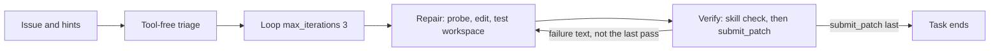

# Structured v5 candidate

Unevaluated development candidate forked from `agents/structured-v4-10m`. It does
not replace that candidate, its archive, or its 3/3 diagnostic. No GPU run, score,
or submission is claimed. `agents/structured-v4`, `agents/structured-v4-10m`, and
`agents/simple-v3` are unchanged.

Hypothesis: a short repair/verify loop, thinking disabled, a hard tool boundary on
verify, and an explicit workspace-import rule reduce late edits, context overflow,
and host-package confusion inside a 270 second task. That is a mechanism hypothesis.
It is not a measured gain.

## Flow

Root is a SequentialAgent: triage, then a LoopAgent of repair and verify.
`max_iterations` is 3. Omitting it compiles to 500, so the cap is explicit.
There is no `exit_loop` tool. When the loop finishes without a submission, the
harness nudge starts the root again, which reruns triage. Verify's prompt therefore
calls `submit_patch` on iteration 3, and whenever under 40 seconds remain, whether
or not the check passed.

## Token arithmetic

The model context is 32768 tokens. vLLM 0.19.1 rejects a request when the prompt
is at least 32768 tokens, or when prompt plus `max_output_tokens` exceeds 32768.
That rejection is not retried. `swegemma` 0.2.7 sets `agent_patch = ''` before the
loop and copies a submitted patch only after the loop returns. Any other exception
skips that copy and the fallback diff. A context overflow therefore drops even a
patch that was already submitted. Submitting early is not protection against overflow.

| Role | max_output_tokens | Prompt must stay under |
| --- | --- | --- |
| triage | 1024 | 31744 |
| repair | 2048 | 30720 |
| verify | 1536 | 31232 |

The largest reservation is 2048, so every call needs its prompt under 30720 tokens.
Thinking is off, so those completion tokens are not shared with a thinking budget.
`include_contents: none` is set on triage, repair, and verify. The field is legal
only on LlmAgent; the SequentialAgent and LoopAgent do not set it. Each role then
sees the current user message or the previous role's final reply, plus its own
tool results for the current turn, instead of the other role's tool transcript.

Prompts bound tool output: `read_file` ranges of at most 80 lines, shell output
through `head -n 40` and `head -c 4000`, source-lookup's existing hit and window
caps, and verify-patch's truncated JSON. Triage has no tools, so it cannot
accumulate a tool transcript. `{problem_description}` is in every instruction
because a nudge is a new user message and the earlier harness prompt is outside
the `include_contents: none` window. `{hints?}` is the ADK 1.36.1 optional form:
the harness adds `hints` to session state only when hint text is non-empty
(`agent_runner.py` session_state), and a required `{hints}` raises `KeyError`
otherwise.

## Thinking knob

`sub_agents/thinking.yaml` is the only `thinking_budget`. All three roles include
it. The value is 0, with `include_thoughts: true`. On adk-submission 0.2.12,
`thinking_budget <= 0` forces `enable_thinking` false even when thoughts are
requested, and no `thinking_token_budget` is sent. Changing that one integer to
256, and leaving `include_thoughts: true`, is the ablation that turns thinking on
with a 256-token budget. Temperature stays 0.5 and top_p stays 0.95. Temperature
0.2 is not used.

## What changed from structured-v4-10m, and why

| Item | v4-10m | v5 | Why |
| --- | --- | --- | --- |
| Shape | Sequential triage, repair, verify | Sequential triage, Loop(3) of repair then verify | A failed verify can send one concrete failure back. The cap is small because exhausting it reruns triage. |
| Time / calls / turns | 10 min, 80 calls, 60 turns | 4.5 min (270s), 48 calls, 48 turns | Coordinator cap is 270s and 40-60 calls. 48 turns matches 48 calls so neither limit is far tighter. Command ceiling stays 300s and is still lowered by remaining task time. |
| Thinking | 256 / 1024 / 1024, thoughts on | 0 on every role, one file | 0.2.12 enforces the numeric budget. 0 turns thinking off. One file is the ablation knob. |
| Output cap | 1024 / 4096 / 4096 | 1024 / 2048 / 1536 | Keeps prompt + completion under 32768. Overflow discards a submitted patch. |
| Triage contents | `default` | `none`, plus `{problem_description}` and `{hints?}` | A nudge must not replay the whole tool history. The issue still has to be in the instruction. |
| Triage work | Tool-free brief | Still tool-free. The brief names at most 3 unverified files. Identical calls are refused because there are no tools. | See the ambiguity note below. `tools: []` is the structural bound. Per-agent `max_llm_calls` is rejected by the schema. |
| Repair deadline | Soft handoff at 360s | Provisional edit by about 12 counted calls or 95s (35% of 270s) | Late first edits were the diagnostic failure mode. No repeated identical calls. |
| Repair submit | Not present | Still not present | A safety-net submit would skip verify. Evidence below. |
| Verify tools | get_status, read_file, edit_file, run_command, submit_patch, plus task-memory | get_status, read_file, edit_file, submit_patch, plus verify-patch only | The spec's tool list. No shell and no `write_file`, so the check goes through the skill. |
| Verify stop rule | Submit once after a fingerprint match | Submit on the first passing workspace check. On an earlier failure, return a concrete `loop_iteration` report and do not submit. On the last iteration, submit anyway. | No exit tool. Text after submit ends the task, so `submit_patch` is the last tool call. Edits after the last submit are dropped, so an edit is followed by another submit. |
| Import rule | Soft "workspace import details" | Exact `module.__file__` probe in the triage and repair prompts. `INSTALLED-COPY` plus `/workspace/src` means `PYTHONPATH=/workspace/src:/workspace`. Never `python -I` or `python -E`. | Subprocess sandbox sets PYTHONPATH to the workspace root and skips the editable install. |
| verify-patch | Root pytest.ini / conftest.py and `tests/` / `test/` prefixes | Also nested conftest.py, any `test_*.py`, pytest.ini, pyproject.toml, and setup.cfg. Repro JSON adds `import_origin` and `default_import_origin`. | Report where the check imported the package, and flag the protected set grading resets. |
| Scratch | `/tmp` only, as a prompt | Top-level `/workspace/build/` or `/tmp` in every prompt that can create files, and in the skill. Never a real source file under a nested `build/` or `dist/`. | Untracked `build/`, `dist/`, and `.adk_exec_*.py` are git-excluded at any depth. A new source file under `pkg/build/` would be dropped. |
| task-memory, source-lookup | Present | Byte-identical copies | No new skills. Repair still has them. Verify does not load task-memory. |
| Graph tools | On repair | Still on repair | Not part of the binding change. The prompt allows one lookup, then stops. |
| Sampling and model | 0.5 / 0.95, `gemma-4-31b-it-qat-w4a16-ct` | Same | Temperature 0.2 loops. No adapters, callbacks, or custom tools. |

Callbacks and per-agent `max_llm_calls` are not used. The schema accepts callback
names and then drops them, and `max_llm_calls` is an extra field that fails
compilation.

## Repair does not submit

The coordinator asked for a repair safety-net `submit_patch` after the first
passing check or near the deadline, unless a submission ends the task before verify.

`submit_patch` in swegemma 0.2.7 only stores the diff and sets `patch_submitted`.
The runner then ends the task on either of two conditions (`harness/agent_runner.py`):

- A final response from any non-tool author that contains text and no function
  call, once a patch has been submitted (about lines 554-577).
- `run_async` returning after any submission (about lines 632-634), which also
  skips the nudge.

Repair has to finish with a text report. That report is its `output_key` and the
message verify must see. That text is a final response after the submission, so
the event loop breaks and the LoopAgent never reaches verify. An LlmAgent does
not finish on a tool call; it continues until the model returns a response
without tool calls, which is the text handoff. There is no supported way for
repair to submit and still transfer.

v5 therefore leaves `submit_patch` off repair. Overflow is handled by the output
caps, `include_contents: none`, and bounded tool output above. The guaranteed
final submit is verify's, including on the last iteration and under 40 seconds
remaining.

Checkpoint submits still matter inside verify: a timeout or turn cap keeps a
patch that was submitted before the exception, and a later edit is not in that
patch unless verify submits again. They do not survive a context overflow.

## Import origin and src-layout tasks

The import-origin probe checks `module.__file__` from `/workspace`, not `pip show`.
Flat layouts (FastAPI, Rich) import the workspace when PYTHONPATH is the workspace
root. src-layout repos do not: the default import is the host copy. The requests
tasks are src-layout. In our notebook's subprocess sandbox, both the agent's raw
`python` and the official grading command import the host `requests`, so a local
pass or fail on those tasks is unreliable in either direction.

`docs/STRUCTURED_V5.md` records the rule used for promotion: src-layout requests
tasks are excluded from promotion decisions until grading imports the workspace
copy. dev13 and the diagnostic cohort are FastAPI and Rich only; they are not
excluded by this shadowing result. Host dependency versions (starlette, pydantic)
still apply to those runs. The hidden scorer's sandbox (Docker editable install
versus subprocess) was not re-checked here.

verify-patch sets `PYTHONPATH` to the workspace root plus `workspace/src` for its
own child, and reports that origin as `import_origin`. `default_import_origin`
repeats the same imports with only the workspace root on `PYTHONPATH`, which is
what a raw command and notebook grading see. `imports_installed_copy` is true
only when the skill's own child environment imported a host copy.

## Spec notes

- Triage stays tool-free. The binding line asks triage to identify the top 3
  files with no repeated identical calls. A tool-using triage cannot be hard-capped:
  per-agent `max_llm_calls` fails schema validation, and callbacks are dropped.
  `tools: []` is the bound that actually holds. The brief must name at most 3
  unverified files from the issue, hints, and layout. Repair owns the 12-call /
  95-second edit rule and the identical-call ban. If triage was meant to search,
  that needs a different structure than an uncapped LlmAgent.
- `max_iterations` is 3, not 4. Three repair/verify passes already fill a 270s
  clock. Four would make the nudge-restart of triage more likely.
- Turn limit is 48, equal to the 48-call cap, inside a 270s clock. `get_status`
  and `submit_patch` do not count as tool calls but do count as turns.
- Protected-path audit matches the coordinator list: nested `conftest.py`,
  `test_*.py`, `tests/` and `test/` directories, `pytest.ini`, `pyproject.toml`,
  and `setup.cfg`. It does not add `tox.ini`, `*.pth`, `*_test.py`, or `testing/`.
  Those are still reset by grading if the harness protected set is wider. The
  audit flags them only when they match the list above.
- `{hints?}` is used because empty hints are omitted from session state. This is
  the optional placeholder in google-adk 1.36.1 `inject_session_state`, not a
  second copy of the hint text.
- Graph tools remain on repair. Dropping them would be a separate confound.
- No new skill. verify-patch gained import-origin fields and a wider audit. It
  did not gain a clean or pytest mode. Verify has `edit_file` for a revert it can
  reconstruct, then must submit again. It cannot `rm` scratch. Scratch is supposed
  to be excluded by path.

## Validation

Portable checks are `gemma-lab validate` and `gemma-lab pack`. They are not the
official compiler. The YAML uses only schema fields that adk-submission 0.2.12
accepts: SequentialAgent, LoopAgent with `max_iterations >= 1`, LlmAgent
`include_contents: none`, `thinking_budget: 0`, and the official tool names.
`instruction` is required on LlmAgent and is included. LoopAgent does not get
`include_contents`. Official `compile_submission` still needs the worker
wheelhouse; see the PR for whether that compile was run here.

Tests in `tests/test_structured_v5.py` load `agents/structured-v5`'s ledger,
lookup, and verify-patch modules. They do not replace `tests/test_agent_skills.py`,
which still loads `agents/structured-v4`.

Archive hash is recorded in `docs/STATUS.md` after `gemma-lab pack`. Existing
candidate sources are unchanged, so their archive hashes stay the same when
repacked.

## Promotion

Do not promote v5 from helper tests or from this document. The next measurement,
when one is requested, is the same frozen diagnostic cohort, with src-layout
requests tasks left out of the promotion decision. Holdout stays untouched.
A 270s cap is a submission-shaped budget, not evidence that 120 tasks fit in
12 hours.
